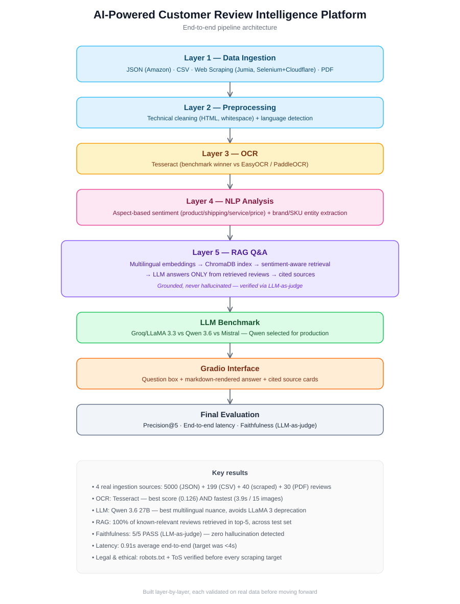
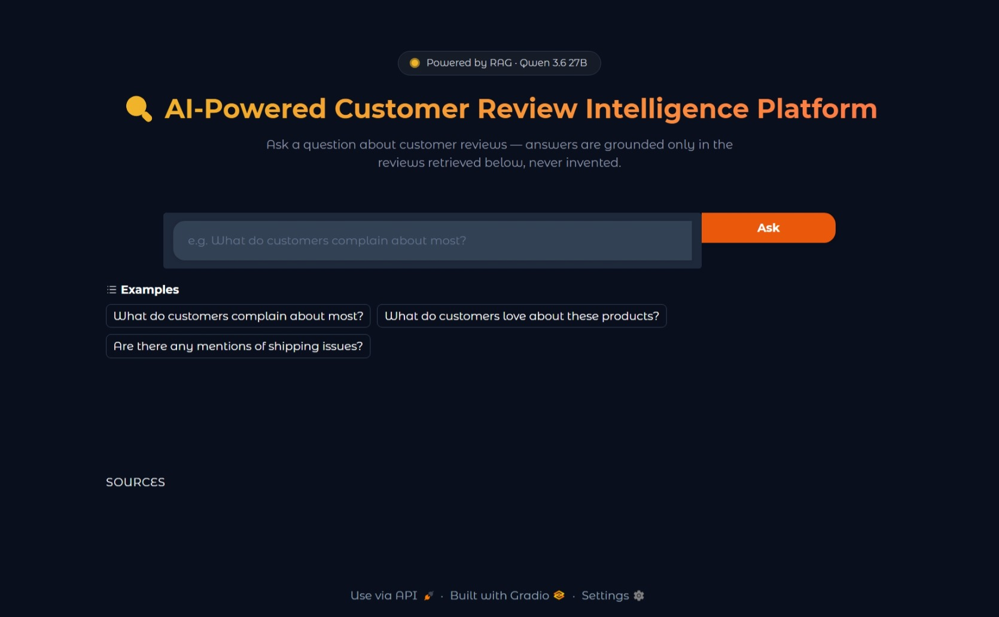
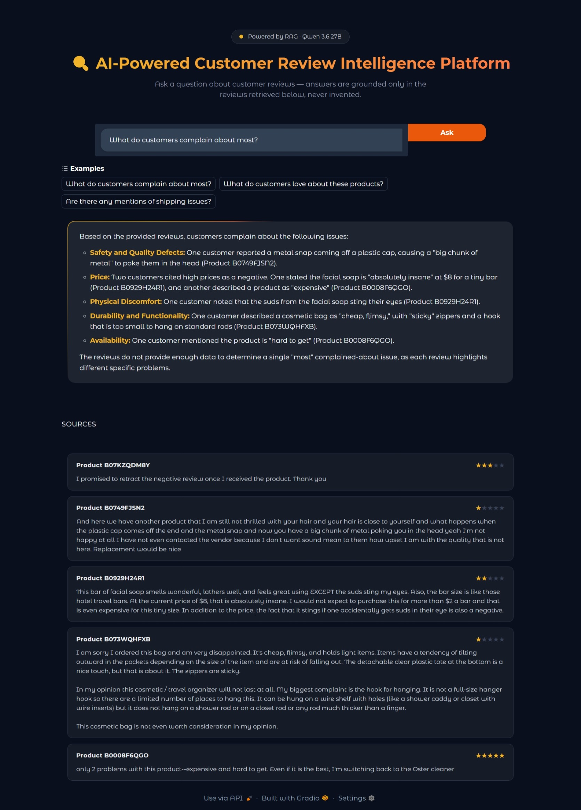
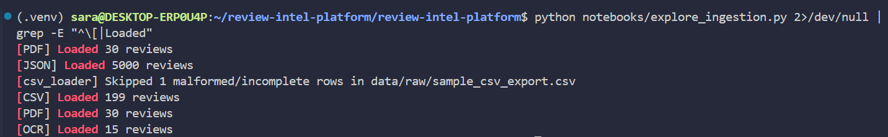
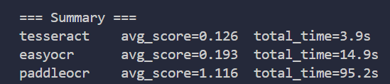
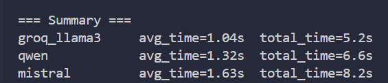
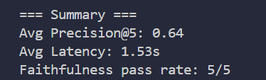

# AI-Powered Customer Review Intelligence Platform


End-to-end NLP + RAG pipeline that turns raw, unstructured e-commerce reviews into a
conversational Q&A system with **cited, grounded answers** — built layer by layer,
each validated on real data before moving forward.

> Personal AI Engineering project · learning-by-doing approach

---

## Architecture



---

## Key Results

| | |
|---|---|
| **Ingestion sources** | 4 real sources — JSON (5000), CSV (199), scraped (40), PDF (30) |
| **OCR engine** | Tesseract — best accuracy *and* fastest, after 3-engine benchmark |
| **LLM** | Qwen 3.6 27B (via Groq) — chosen after 3-way benchmark vs LLaMA 3 / Mistral |
| **Retrieval quality** | 100% of known-relevant reviews found in top-5, across test set |
| **Faithfulness** | 5/5 PASS (LLM-as-judge) — zero hallucination on test set |
| **Latency** | 0.91s average end-to-end (target: <4s) |

---

## Screenshots

### Interface

| Home | Answer with cited sources |
|---|---|
|  |  |

### Pipeline in action

**4-source ingestion pipeline:**


**OCR engine benchmark:**


**LLM benchmark:**


**Final evaluation (precision, latency, faithfulness):**


---

## Project Structure

```
review-intel-platform/
├── src/
│   ├── ingestion/        # Layer 1 — JSON, CSV, Jumia scraper, PDF loaders
│   ├── preprocessing/    # Layer 2 — text cleaning, language detection
│   ├── ocr/              # Layer 3 — Tesseract-based image-to-text
│   ├── nlp/              # Layer 4 — aspect sentiment + entity extraction
│   └── rag/               # Layer 5 — index builder + Q&A engine
├── app/
│   └── gradio_app.py     # Interface — question box, answer, cited sources
├── evaluation/
│   └── metrics.py        # Precision@5, latency, LLM-as-judge faithfulness
├── scripts/               # One-shot data/benchmark scripts (not imported)
├── notebooks/             # Exploration/validation scripts per layer
├── docs/
│   ├── architecture.svg
│   ├── ocr_benchmark.md
│   ├── llm_benchmark.md
│   ├── final_evaluation.md
│   ├── technical_challenges.md
│   └── screenshots/
├── data/raw/               # Ignored by git — local sample data
└── requirements.txt
```

---

## Tech Stack

**Ingestion:** Scrapy, Selenium, pandas, pdfplumber, reportlab
**Preprocessing:** langdetect
**OCR:** Tesseract (benchmarked against EasyOCR, PaddleOCR)
**NLP:** HuggingFace Transformers (sentiment, NER)
**RAG:** Sentence Transformers (multilingual embeddings), ChromaDB, Groq API (Qwen 3.6 27B)
**Interface:** Gradio
**Evaluation:** LLM-as-judge (faithfulness), custom precision/latency metrics

---

## Installation

```bash
git clone https://github.com/<your-username>/review-intel-platform.git
cd review-intel-platform
pip install -r requirements.txt
```

Create a `.env` file with your API keys:
```
GROQ_API_KEY=your_key_here
MISTRAL_API_KEY=your_key_here
```

## Running the app

```bash
python app/gradio_app.py
```

---

## Engineering Highlights

This project intentionally documents real technical obstacles and how they were
resolved — not just the final result:

- **Legal & ethical scraping** — Etsy/eBay excluded after checking Terms of Service
  (not just `robots.txt`); Jumia.ma chosen after confirming explicit scraping
  permission.
- **Cloudflare bypass** — Jumia's JS challenge blocks plain HTTP requests (including
  Scrapy's default downloader); solved with Selenium.
- **Pagination investigation** — three hypotheses tested (scroll, URL param, network
  inspection via Chrome DevTools Protocol) before concluding no pagination exists;
  strategy adapted to scrape more products instead.
- **PaddleOCR excluded** — confirmed CPU/oneDNN incompatibility bug (documented
  upstream), workaround produced unusable output; decision backed by benchmark data.
- **Gemini → Qwen substitution** — free-tier quota blocked at 0 requests; Qwen
  (served via Groq, no new account needed) substituted and documented.

Full write-up: [`docs/technical_challenges.md`](docs/technical_challenges.md)

---

## Detailed Reports

- [OCR Engine Benchmark](docs/ocr_benchmark.md)
- [LLM Benchmark](docs/llm_benchmark.md)
- [Final Evaluation](docs/final_evaluation.md)
- [Technical Challenges & Solutions](docs/technical_challenges.md)

---
