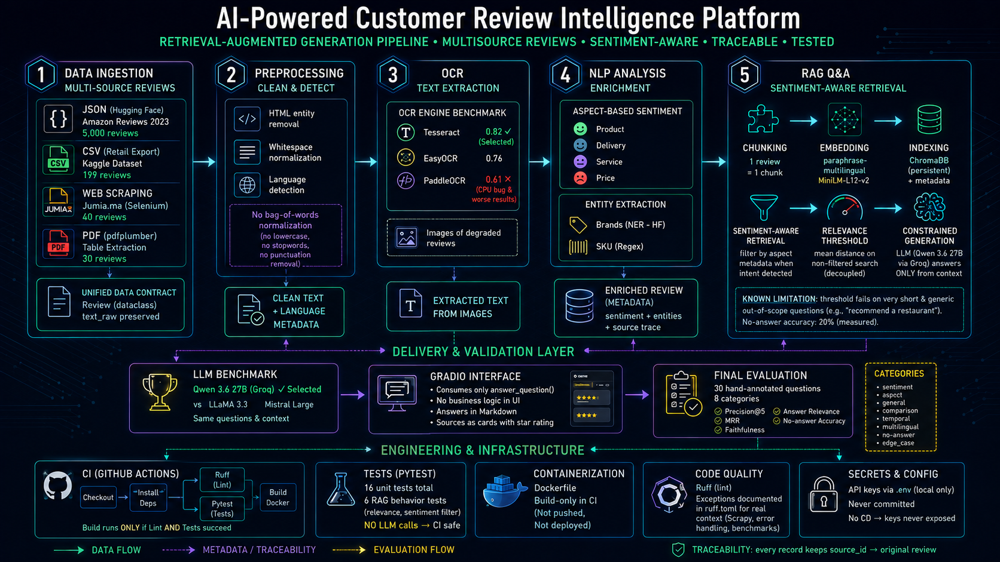
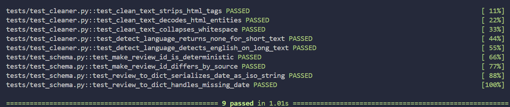

# AI-Powered Customer Review Intelligence Platform


An end-to-end NLP + RAG pipeline that transforms raw, unstructured e-commerce
reviews — scraped, exported, scanned, or photographed — into a conversational
Q&A system with **grounded, cited answers**. Built and validated layer by
layer, on real data, with every design decision benchmarked rather than
assumed.

> Personal AI Engineering project · learning-by-doing approach

---

## Table of Contents

- [Architecture](#architecture)
- [Project Structure](#project-structure)
- [Problem Statement](#problem-statement)
- [Key Results](#key-results)
- [Screenshots](#screenshots)
- [Design Decisions](#design-decisions)
- [Tech Stack](#tech-stack)
- [Installation](#installation)
- [Usage](#usage)
- [Testing & Observability](#testing--observability)
- [CI/CD](#cicd)
- [Engineering Highlights](#engineering-highlights)
- [Limitations & Future Work](#limitations--future-work)
- [Detailed Reports](#detailed-reports)

---

## Architecture

A 5-layer RAG pipeline — ingestion → preprocessing → OCR → NLP enrichment →
retrieval/generation — built around a single `Review` contract that every
source converts into before touching the rest of the pipeline, and that
never loses the original text. Retrieval is **sentiment-aware** (filtered
on Layer 4 metadata, not just similarity), gated by an empirically
calibrated **relevance check** before any LLM call, and generation is
constrained to retrieved context only — faithfulness verified via
LLM-as-judge, not assumed.



---

## Project Structure

```
review-intel-platform/
├── .github/
│   └── workflows/
│       └── ci.yml             # Lint (ruff) + tests in parallel → Docker build validation
├── src/
│   ├── ingestion/          # Layer 1 — JSON, CSV, Jumia scraper, PDF loaders
│   │   ├── schema.py         # Shared Review contract + deterministic ID hashing
│   │   ├── json_loader.py    # Amazon Reviews 2023 (JSON Lines)
│   │   ├── csv_loader.py     # Retailer-style CSV export
│   │   ├── jumia_scraper.py  # Selenium (Cloudflare bypass) + Scrapy discovery
│   │   └── pdf_loader.py     # Table extraction via pdfplumber
│   ├── preprocessing/       # Layer 2 — technical cleaning + language detection
│   ├── ocr/                  # Layer 3 — Tesseract-based image-to-text
│   ├── nlp/                  # Layer 4 — aspect sentiment + brand/SKU NER
│   └── rag/                   # Layer 5 — ChromaDB index + Q&A engine
├── app/
│   └── gradio_app.py        # Chat interface — answer + cited source cards
├── evaluation/
│   ├── dataset/
│   │   └── rag_evaluation.json  # 30 hand-annotated questions, 8 categories
│   ├── annotate.py            # Interactive tool: confirms relevance against real retrieval
│   └── metrics.py              # Precision@5, MRR, faithfulness, answer relevance, no-answer accuracy
├── tests/                     # Unit tests (pytest) — 16 tests
│   ├── test_schema.py
│   ├── test_cleaner.py
│   └── test_rag.py             # Retrieval/relevance behavior, no LLM calls (CI-safe)
├── scripts/                   # One-shot data/benchmark scripts (never imported)
├── notebooks/                 # Per-layer validation scripts against real data
├── docs/
│   ├── architecture.png
│   ├── ocr_benchmark.md
│   ├── llm_benchmark.md
│   ├── final_evaluation.md
│   ├── technical_challenges.md
│   └── screenshots/
├── data/raw/                   # Git-ignored — local sample/test data
├── Dockerfile                   # Validated in CI (build-only, never pushed/deployed)
├── .dockerignore
├── ruff.toml                    # Documents intentionally-ignored lint rules
├── .env.example                 # Documents expected env vars, no real secrets
├── requirements.txt
└── requirements-dev.txt         # pytest, ruff — dev-only, not needed at runtime
```

---

## Problem Statement

Star ratings alone can't tell you *why* a product gets 3 stars — a great
product with slow shipping and a defective one both average the same score.
Manually reading thousands of reviews to spot a defect pattern doesn't scale,
and keyword search misses semantic matches (*"zipper broke"* vs *"zipper
keeps opening"* are the same complaint, different words).

This platform ingests reviews from four different real-world sources,
enriches them with aspect-level sentiment and entity extraction, and exposes
a RAG-based chat interface that answers plain-language questions with
citations back to the exact reviews used — never a fabricated answer, and
never an answer generated when nothing relevant exists in the corpus.

---

## Key Results

| Metric | Result |
|---|---|
| **Ingestion sources** | 4 real sources — JSON (5,000), CSV (199), web-scraped (40), PDF (30) |
| **OCR engine (of 3 benchmarked)** | Tesseract — best accuracy (0.126 normalized edit distance) *and* fastest (3.9s/15 images) |
| **LLM (of 3 benchmarked)** | Qwen 3.6 27B via Groq — best multilingual nuance, avoids LLaMA 3.3 deprecation |
| **Evaluation set** | 30 hand-annotated questions across 8 categories (sentiment, aspect, general, comparison, temporal, multilingual, no-answer, edge cases) |
| **Retrieval quality** | Avg Precision@5 0.55, Avg MRR 0.80 across answerable categories |
| **Faithfulness (LLM-as-judge)** | 90%+ PASS across categories — near-zero hallucination on grounded questions |
| **No-answer accuracy** | 20% — a known limitation on short, generic off-topic questions (see Limitations) |
| **Unit tests** | 16/16 passing (`schema.py`, `cleaner.py`, `qa.py` retrieval behavior) |
| **Legal compliance** | Every scraping target vetted against both `robots.txt` *and* Terms of Service before implementation |

---

## Screenshots

### Interface

| Home | Answer with cited sources |
|---|---|
|  |  |

### Pipeline validation

**4-source ingestion, end to end:**


**OCR engine benchmark (Tesseract vs EasyOCR vs PaddleOCR):**


**LLM benchmark (Groq/LLaMA 3 vs Qwen vs Mistral):**


**Final evaluation — precision, MRR, latency, faithfulness:**


**Unit test suite:**



---

## Design Decisions

A few choices that shaped the system, and why:

**One `Review` schema, four ingestion sources.** Rather than letting each
loader (JSON, CSV, scraper, PDF) return its own shape, every source converts
into a single `Review` dataclass before touching the rest of the pipeline.
Downstream layers (preprocessing, NLP, RAG) never need to know where a
review came from.

**Light preprocessing only — no bag-of-words normalization.** The pipeline
is built around transformers (sentiment model, embeddings), which are
trained on natural text. Lowercasing, stripping punctuation, and removing
stopwords — standard for classical NLP — would actually *hurt* a transformer's
performance here, since it pushes the input out of the distribution the
model was trained on. Only technical noise (HTML artifacts, broken
whitespace) is cleaned; punctuation and casing are preserved.

**`text_raw` is never modified.** Every transformation writes to
`text_clean`; the original text stays intact end-to-end, because the RAG
layer cites the *original* review, not a normalized version of it.

**One review = one chunk.** Rather than splitting text by a fixed token
count, each review is indexed whole. This keeps citations traceable to
exactly one source and avoids severing a review's meaning mid-sentence.

**Sentiment-aware retrieval, not just semantic similarity.** Plain vector
similarity finds text on the right *topic* but can't distinguish a positive
review from a negative one mentioning the same subject. Retrieval filters on
Layer 4's per-aspect sentiment metadata when the question signals intent
(e.g. "complaints") — a review rated 5★ but complaining about price on one
aspect is still surfaced correctly, something a naive `rating < 3` filter
would miss entirely.

**Relevance is checked on an unfiltered search, deliberately decoupled from
the sentiment filter.** An early version checked relevance on the *same*
sentiment-filtered query used for retrieval — this silently rejected
perfectly relevant questions whenever the filtered subset had a higher
average distance than the full corpus. Relevance ("does this topic exist in
the corpus at all?") and sentiment filtering ("which of the relevant results
match this tone?") are two different questions and now run as two separate
checks.

**The LLM never answers from memory.** The system prompt constrains
generation strictly to the retrieved reviews, with explicit instructions to
say "not enough information" rather than infer. Verified empirically via
LLM-as-judge, not just asserted in the prompt. A relevance threshold
(average similarity distance, calibrated on real queries — not guessed)
rejects off-topic questions *before* the LLM is even called.

---

## Tech Stack

| Layer | Technology | Why |
|---|---|---|
| Scraping | Scrapy, Selenium | Scrapy for legal/fast static crawling; Selenium where Cloudflare's JS challenge blocks plain HTTP |
| Data handling | pandas, pdfplumber, reportlab | CSV/PDF parsing and generation of realistic test fixtures |
| Preprocessing | langdetect | Lightweight language ID, thresholded to avoid unreliable short-text guesses |
| OCR | Tesseract | Selected via 3-engine benchmark on accuracy *and* speed, not assumption |
| Sentiment/NER | HuggingFace Transformers | Pretrained multilingual models — no labeled data required to start |
| Embeddings | Sentence Transformers (multilingual) | Matches the FR/EN/AR mix found in real scraped data |
| Vector store | ChromaDB | Persistent, metadata-filterable — enables sentiment-aware retrieval |
| LLM | Groq API (Qwen 3.6 27B) | Selected via 3-way benchmark; free, fast, avoids LLaMA 3.3 deprecation |
| Interface | Gradio | Rapid, styleable chat UI with custom CSS/animation |
| Evaluation | LLM-as-judge, custom metrics | Automated faithfulness, precision, and MRR checking at scale |
| Testing | pytest | Unit coverage on core data contracts and text-cleaning logic |

---

## Installation

```bash
git clone https://github.com/ouhaddousara/AI-Powered-Customer-Review-Intelligence-Platform.git
cd AI-Powered-Customer-Review-Intelligence-Platform
pip install -r requirements.txt
```

Copy `.env.example` to `.env` and fill in your keys:
```bash
cp .env.example .env
```
```
GROQ_API_KEY=your_key_here
MISTRAL_API_KEY=your_key_here
```

---

## Usage

**Launch the chat interface:**
```bash
python app/gradio_app.py
```

**Or query the pipeline programmatically:**
```python
from src.rag.qa import answer_question
import os

result = answer_question(
    question="What do customers complain about most?",
    groq_api_key=os.getenv("GROQ_API_KEY"),
)

print(result["answer"])
for source in result["sources"]:
    print(f"[{source['product_id']}, {source['rating']}★] {source['text_raw'][:80]}")
```

---

## Testing & Observability

```bash
pytest tests/ -v
```
16 unit tests covering deterministic ID generation, date serialization, HTML/whitespace
cleaning, language-detection thresholds, and RAG retrieval behavior (relevance checking,
sentiment-filter detection, and a regression test for the filter-coupling bug described
below).

```bash
python evaluation/annotate.py
```
Interactive annotation tool — runs real retrieval against ChromaDB and asks for
relevance confirmation per candidate, rather than guessing ground-truth IDs blind.

```bash
python evaluation/metrics.py
```
Runs the full evaluation suite against `evaluation/dataset/rag_evaluation.json` — 30
questions across 8 categories, reporting Precision@5, MRR, faithfulness, answer
relevance, and no-answer accuracy per category.

---

## CI/CD

Every push and pull request to `main` triggers a GitHub Actions pipeline:

```text
Push / Pull Request
        │
   ┌────┴────┐
   ↓         ↓
 Lint      Tests
   │         │
   └────┬────┘
        ↓
 Docker Build
```

Lint and tests run **in parallel** — they're independent checks, so there's
no reason to serialize them. Docker build only runs once both succeed,
reflecting a clear separation of concerns: code quality, functional
correctness, and packaging validation.

The image is built and validated on every push but **not pushed to a
registry or deployed** — this project runs locally by design, keeping API
keys out of any public-facing infrastructure. See [Limitations & Future
Work](#limitations--future-work) for the deployment path this leaves open.

---

## Engineering Highlights

Real technical obstacles hit and resolved during development — documented
because the resolution process matters as much as the result:

- **Legal scraping vetting** — Etsy and eBay excluded after checking Terms
  of Service (not just `robots.txt`, which can be permissive while the ToS
  explicitly forbids scraping — see *eBay v. Bidder's Edge*, 2000). Jumia.ma
  selected after confirming an explicit scraping allowance in its
  `robots.txt`.
- **Cloudflare bypass** — Jumia's JS challenge blocks plain HTTP requests,
  including Scrapy's default downloader (same failure mode as `curl`).
  Resolved with Selenium, a real browser engine that resolves the challenge
  natively.
- **Pagination investigation, not assumption** — three hypotheses tested in
  order (infinite scroll, URL query param, hidden API via Chrome DevTools
  Protocol network logs) before concluding no pagination exists on that
  endpoint. Strategy adapted to scrape more products instead of forcing a
  non-existent mechanism.
- **PaddleOCR excluded on evidence, not convenience** — a confirmed
  upstream `paddlepaddle` CPU/oneDNN bug was worked around
  (`enable_mkldnn=False`), but the resulting output was empirically worse
  (score 1.116 vs Tesseract's 0.126) and 25× slower — excluded from
  production based on benchmark data, not abandoned at the first error.
- **Gemini → Qwen substitution, documented** — Gemini's free-tier API
  returned a hard quota block (`429`, limit locked at 0) on every request.
  Rather than linking a billing account for a zero-cost workload, Qwen was
  substituted — served via the already-integrated Groq API, avoiding a new
  point of failure.
- **Reasoning-model leak caught and fixed** — Qwen 3.6, a reasoning model,
  leaked its internal `<think>` trace into production answers by default;
  fixed via `reasoning_effort="none"`, which also cut latency ~3×.
- **Relevance-threshold calibration and a coupling bug** — the first
  approach (min-distance threshold) was tested and rejected on evidence: a
  clearly off-topic question could still produce one spuriously close match.
  Switched to average distance across top-k, calibrated on real queries.
  Once implemented, a second bug surfaced empirically: relevance checked on
  a *sentiment-filtered* query rejected genuinely relevant questions.
  Fixed by decoupling the relevance check from the sentiment filter entirely.

Full write-up: [`docs/technical_challenges.md`](docs/technical_challenges.md)

---

## Limitations & Future Work

- **Sample size** — the corpus used for demonstration (a few thousand
  reviews per source) is a subset; the pipeline scales to the full dataset
  without code changes, but full-scale indexing wasn't run end-to-end.
- **Jumia review depth** — the scraped source caps at the 10 most recent
  reviews per product (no working pagination found); mitigated by scraping
  more products rather than deeper per product.
- **Aspect detection is keyword-based** — simple and interpretable, but
  would benefit from a trained classifier for edge cases outside the fixed
  keyword list.
- **No-answer detection is unreliable on short, generic off-topic
  questions** — the relevance threshold (average embedding distance)
  correctly rejects clearly unrelated questions (e.g. "What is the
  capital of France?", distance 0.71) but not short generic ones —
  "Can you recommend a good restaurant nearby?" scored *closer*
  (0.61) than genuinely relevant questions (0.66–0.67). This isn't a
  miscalibrated threshold; the two distributions genuinely overlap on
  short generic phrasing. Measured no-answer accuracy: 20% on a
  5-question test set. A more robust fix (dedicated classifier, or an
  LLM-based pre-check) is a natural next step. See
  [`docs/technical_challenges.md`](docs/technical_challenges.md).
- **No conversation memory** — each question is answered independently;
  multi-turn follow-up questions aren't yet supported.
- **Logging is local/console-only** — a real deployment would ship these
  structured log lines to a proper observability stack (latency percentiles,
  error rates, cost per request) rather than stdout.

---

## Detailed Reports

- [OCR Engine Benchmark](docs/ocr_benchmark.md)
- [LLM Benchmark](docs/llm_benchmark.md)
- [Final Evaluation](docs/final_evaluation.md)
- [Technical Challenges & Solutions](docs/technical_challenges.md)